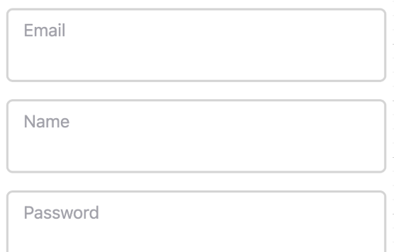

# 리액트 설치 및 컴포넌트 이해하기

## 1. 설치

 > branch: 01-react-basic-01

 - 초기화

```
npm init
```

이 커맨드를 실행하면 (nodejs와 npm이 정상적으로 설치되었다면) 설문조사가 시작된다.
앱 이름은 뭘로 할래, 니 이름은 뭐냐, 깃헙 주소 등등을 물어보는데,
프로덕션 레벨이 아닌 이상 일반 연습에선 중요한건 없으니 그냥 다 엔터 쳐도 상관 없다(엔터치면 전부 기본값으로 설정됨).

일일히 엔터치기도 귀찮으면 그냥 ```npm init -y``` 로 초기화를 하면 전부 기본값으로 된다.


- 리액트 설치

```
npm install react react-dom react-scripts
```

리액트 하나를 설치하면서 왜 3개나 설치하지? 라는 생각이 들 수도 있는데, 셋 다 하나의 리액트가 맞다.

저렇게 3개로 쪼개진 이유는 혹시 커스텀하게 경량 개발을 원하는 개발자가 있을까봐 용도에 따라 3개로 쪼개놓은건데,
우리는 그냥 신경쓰지 말고 저렇게 설치하면 된다.

혹시나 "앞으로 리액트 개발할때 저 패키지 명을 다 외워야 하느냐" "저 패키지 역할을 다 따로 이해하고 공부하여야 하느냐" 하는 식의 쓸데없는 걱정을 하고 있다면, 그 걱정은 접어두시길 바란다. 어차피 우리는 현업에서 바닐라 리액트로 개발하지 않을 것이다. 프로덕션 레벨에서는 nextjs나 remix같은 걸 쓰게 될 테니.

- index.js

package.json이 들어있는 루트 폴더에 src라는 폴더를 하나 만들고, 그 안에 index.js라는 이름으로 파일을 하나 만들자.
그리고 아래의 코드를 붙여 넣는다.

```javascript
import React, { StrictMode } from "react"; // (1)
import { createRoot } from "react-dom/client"; // (2)

const root = createRoot(document.getElementById("root"));
root.render(  // (3)
  <StrictMode>
    <div>hello world</div>
  </StrictMode>
)
```

(1) react라는 패키지로부터 React를 불러오고 있다. 아래 코드 어디서도 React를 참조하고 있지 않지만, 이렇게 React를 소환해야 한다. 이따가 package.json에서 이 src/index.js 를 엔트리 포인트로 지정할 것이다. 그러면 nodejs가 시작하면서 이 파일을 볼 것이고 그때 React를 소환시켜 뒀으면 이게 리액트구나 라는걸 알게 돼서 리액트 식으로 동작하게 될 것이다.

(2) 이번에는 react-dom/client 패키지에서 createRoot라는 함수를 불러오고 있다. 그리고 이 함수는 아래에 보면 자바스크립트에서 익숙하게 본 document.getElementById("root")를 파라메터로 받아 root라는 object를 생성하고 있다. "root"는 이따가 index.html을 생성할때 다시 보게 될 텐데, root라는 id를 가진 태그를 뿌리삼아 여기부터 리액트 렌더링을 시작하겠다는 의미다.

(3) 여기서부터 프론트엔드 항목들을 그리면 된다. 기본적으로 html 문법과 같은데, html 문법으로 전부 그려도 되지만, 리액트에서는 컴포넌트라는 것을 사용해서 더 효율적으로 작성할 예정이다. 일단은 간단하게 hello world 하나만 작성해 보자.


- index.html

루트 폴더에 public/ 폴더를 하나 만들고 그 안에 index.html을 생성한다.
그리고 ! tab 을 차례로 눌러 html 스니펫 코드를 만든 뒤 아래와 같이 수정해 준다.

```html
<!DOCTYPE html>
<html lang="en">
  <head>
    <meta charset="UTF-8">
    <meta name="viewport" content="width=device-width, initial-scale=1.0">
    <title>Document</title>
  </head>
  <body>
    <div id="root"></div>
  </body>
</html>
```

div 태그 안에 root라는 id를 부여한 것이 보일 것이다.
저 root라는 id가 부여된 div를 리액트가 렌더링한 html 요소가 치환하게 되는 것이다.


- package json 수정

scripts 에 아래와 같이 start 와 build 를 추가해 준다. main도 src 폴더 내의 index.js를 가리키도록 바꾸자.

```json
{
  "name": "to-do-list",
  "version": "1.0.0",
  "main": "/src/index.js", // 수정
  "scripts": {
    "start": "react-scripts start",  // 추가
    "build": "react-scripts build"
  },
  "author": "spark",
  "license": "ISC",
  "description": "",
  "dependencies": {
    "react": "^19.1.0",
    "react-dom": "^19.1.0",
    "react-scripts": "^5.0.1"
  },
}
```

그리고 터미널에 ```npm run start``` 를 입력해 보자. 브라우저로 localhost:3000 에 접속해서 hello world 라고 뜬다면 성공한 것이다.


<br><br/>

## 2. 컴포넌트 개발

> branch: 01-react-basic-02

### (1) 컴포넌트 만들고 property 전달하기

- Title.js 생성

src 폴더에 component라는 폴더를 하나 만든다.   
그리고 그 안에 Title.js라는 파일을 생성한다.

```javascript
export default function Title({ value }) {
  return <div>
    {value}
  </div>
}
```

위 코드를 관찰해 보자.

Title 이라는 함수를 선언했고 이 함수는 div라는 html 요소를 리턴하고 있다.
보통 함수는 snakeCase로 선언하는 것이 자바스크립트의 컨벤션이지만,
리액트에서 컴포넌트를 선언할 적에는 PascalCase로 한다.

함수의 파라메터로 {value}를 받고 있고, 이 value가 중괄호로 씌워진 채 div 태그 사이에 들어가 있다.


- index.js 에 Title 컴포넌트 추가

```javascript
import Title from "./component/Title" // 추가

const root = createRoot(document.getElementById("root"));
root.render(
  <StrictMode>
    <Title value="this is title"/> {/* 추가 */}
    <div>hello world</div>
  </StrictMode>
)
```
Title 컴포넌트를 추가하고 value에 "this is title"이라는 값을 전달하였다.
여기까지 하고 커맨드라인에 ```npm run start``` 를 입력하여 어떻게 나타나고 있는지 확인해 보자.

> 종료하고 싶으면 ctrl+c를 누르면 된다.


### (2) css style 주기

이번에는 css 스타일을 추가해 보겠다.

- styles.css 추가

src/ 폴더에 styles.css라는 이름으로 파일을 하나 만들고 아래와 같이 작성한다.

```css
.layout {
  display: flex;
  min-height: 100vh;
  justify-content: center;
  align-items: center;
}

.main-container {
  display: flex;
  flex-direction: column;
  width: 480px;
}
```


- index.js 편집

index.js를 다시 편집한다.

```javascript

import Title from "./component/Title"
import "./styles.css" // 추가

const root = createRoot(document.getElementById("root"));
root.render(
  <StrictMode>
    <div className="layout"> {/* 추가 */}
      <div className="main-container">
        <Title value="this is title"/>
        <div>hello world</div>
      </div>
    </div>
  </StrictMode>
)
```
먼저 styles.css를 import 해 주었고, div를 추가한 후에 각각 layout과 main-container라는 클래스명을 붙여 주었다.
localhost:3000에서 변화된 모습을 확인해 보자.


### (3) tip. 컴포넌트를 이용한 간격 주기

예를 들어 ```<Title />``` 컴포넌트와 ```<div>hello world</div>``` 간의 간격을 조금 띄우고 싶다고 할 때,
styles.css를 편집하여 margin 또는 padding 값을 주는 방법도 있을 수 있겠지만, 아래와 같은 방식으로도 가능하다.

- Space.js 만들기
component 폴더 안에 Space.js를 만든다.

```javascript
export default function Space({ space }) {
  return <div 
    style={{
      margin: `${space}px`,
      display: 'block',
    }}
  >
  </div>
}
```

- index.js

```javascript
...

import Title from "./component/Title"
import "./styles.css"
import Space from "./component/Space" // 추가

...

<StrictMode>
  <div className="layout">
    <div className="main-container">
      <Title value="this is title"/>
      <Space space={10} />       {/*추가*/}
      <div>hello world</div>
    </div>
  </div>
</StrictMode>
...
```

빈 div 컴포넌트를 하나 만들어 여기에 margin 값을 property로 전달받게끔 작성하였다.

그래서 상위 컴포넌트에서 이 Space 컴포넌트를 띄우고 싶은 곳에 삽입하고 10px 만큼 띄우고 싶으면 ```space={10}```을, 5px 만큼 띄우고 싶으면 ```space={5}``` 를 입력하는 식으로 활용하면 된다.

> 한번 값을 바꿔 보자. 브라우저에 localhost:3000을 띄워서, Title과 hello world div간격이 어떻게 바뀌는지 관찰해 보자.


### (부록) 

위에 소개한 컴포넌트들은 prop을 전달하는 방법, css style을 적용하는 방법 등을 설명하느라 최대한 간단하게 작성하였다.   
프로덕션 레벨에서 실제로 사용되는 예시를 보여주겠다.

```typescript
interface InputProps {
  id: string;
  label: string;
  type?: string;
  disabled?: boolean;
  formatPrice?: boolean;
  register: UseFormRegister<FieldValues>,
  required?: boolean;
  errors: FieldErrors;
}

const Input: React.FC<InputProps> = ({
  id,
  label,
  type = "text",
  disabled,
  formatPrice,
  register,
  required,
  errors
}) => {
  return (
    <div className="relative w-full">
      {formatPrice && (
        <span className="absolute text-neutral-700 top-5 left-2">₩</span>
      )}
      <input 
        id={id}
        disabled={disabled}
        {...register(id, { required })}
        placeholder=""
        type={type}
        className={`
          w-full
          p-4
          pt-6
          font-light
          bg-white
          border-2
          rounded-md
          outline-none
          transition
          disabled:opacity-70
          disabled:cursor-not-allowed
          ${forpatPrice ? 'pl-9' : 'pl-4'}
          ${errors[id] ? 'border-rose-500' : 'border-neutral-300'}
          ${errors[id] ? 'focus:border-rose-500' : 'focus:border-black'}
        `}
      />
      <label
        className={`
          absolute
          text-md
          duration-150
          transform
          -translate-y-3
          top-5
          z-10
          origin-[0]
          ${formatPrice ? 'left-9' : 'left-4'}
          peer-placeholder-shown:scale-100
          peer-placeholder-shown:translate-y-0
          peer-focus:scale-75
          peer-focus:-translate-y-4
          ${errors[id] ? 'text-rose-500' : 'text-zinc-400'}
        `}
      >
        {label}
      </label>
    </div>
  )
}
```

위의 코드는 아래와 같은 입력칸들을 만들기 위해 작성한 컴포넌트 이다.

<p align="center">
 
</p>

tailwindcss와 typescript를 이용해 작성하였고, react-hook-form 이라는 라이브러리도 사용하였다. 엄청 복잡해 보이고 코드도 길어보이지만 원리를 알면 매우 간단하다. 

이 예시를 보여주는 이유는 현업에서 쓰는 컴포넌트는 이렇게 코드도 길고 복잡하다 라는 말을 하려는게 아니고, 파라메터를 보여주기 위해서 이다. 보면 파라메터로 id, label, disable여부 등등 여러 파라메터를 받고 있는데, label에 "Email"을 전달하거나 "Name"을 전달하는 식으로 여러개의 input 컴포넌트를 만들어 쓰는 식이다.

이처럼 컴포넌트는 여러 파라메터를 받아서 다양하게 활용할 수 있게끔 설계한다. 컴포넌트를 여러곳에서 다양하게 재사용할 수 있게 하는 것이다. 컴포넌트를 이용해서 코드의 반복을 줄이고 다양하게 재사용하는 것은 바닐라 자바스크립트에서는 구현하기 힘든 리액트만의 장점 가운데 하나다.
